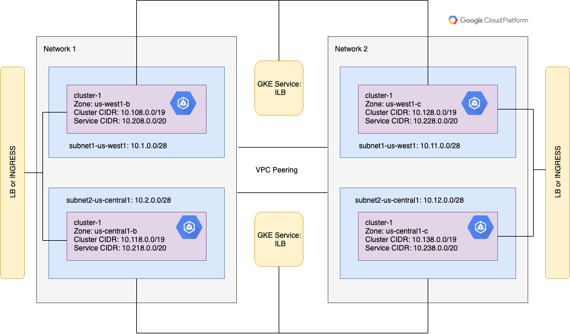

# Kubernetes Engine Networking
## Table of Contents

<!--ts-->
* [Introduction](#introduction)
* [Architecture](#architecture)
   * [GCP Network1](#gcp-network-network1)
      * [Kubernetes Engine Cluster 1](#kubernetes-engine-cluster-1)
      * [Kubernetes Engine Cluster 2](#kubernetes-engine-cluster-2)
      * [Other Resources](#other-resources)
   * [GCP Network2](#gcp-network-network2)
      * [Kubernetes Engine Cluster 3](#kubernetes-engine-cluster-3)
      * [Kubernetes Engine Cluster 4](#kubernetes-engine-cluster-4)
      * [Other Resources](#other-resources-1)
   * [Notes](#notes)
* [Prerequisites](#prerequisites)
   * [Initialize Gcloud](#initalize-gcloud)
   * [Supported Operating Systems](#supported-operating-systems)
   * [Tools](#tools)
   * [Versions](#versions)
   * [Setup](#setup)
   * [Directory Structure](#directory-structure)
* [Deployment Steps](#deployment-steps)
* [Validation](#validation)
* [Verify the pod-to-service communication](#verify-the-pod-to-service-communication)
* [Tear Down](#tear-down)
* [Troubleshooting](#troubleshooting)
* [Deleting Resources Manually](#deleting-resources-manually)
* [Relevant Materials](#relevant-materials)

<!--te-->

## Kubernetes Engine Communication Through VPC Peering

## Introduction

Google Cloud networking with Kubernetes Engine clusters can be
complex.  This demo strives to simplify the best practices for exposing cluster
services to other clusters and establishing network links between Kubernetes Engine clusters
running in separate projects.

This project contains a set of Deployment Manager templates that allows a user to
create networks, subnets, and Kubernetes Engine clusters. This project demonstrates the
following best practices.

1. Network design of launching Kubernetes Engine clusters in custom networks.
1. Assigning node CIDR, container CIDR and service CIDR for Kubernetes Engine clusters.
1. IP range management.
1. Exposing pods of Kubernetes Engine clusters over peered networks

This example also includes Kubernetes manifests for:

1. Deploying the Nginx pods in clusters.
1. Exposing the Nginx pods of the clusters with different types of services like cluster
IP, nodeport, internal load balancer, Network Load Balancer and Ingress.
1. Validating the pod-to-service communication over the peered networks.

## Architecture

The execution of this code in the GCP environment creates two custom GCP networks connected via VPC peering. Each network will have two subnets one in the us-west1 region and the other in the us-east1 region. Each of the subnets hosts a Kubernetes Engine cluster which has nginx pods and services to expose those pods across other clusters.




Below is the detailed overview of GCP resources which will be created.

### GCP Network 1
#### Kubernetes Engine Cluster 1
1. Subnet: subnet1-us-west1 (10.1.0.0/28)

|cluster-ipv4-cidr|service-ipv4-cidr|zone|Initial Node count|Node Image
|---|---|---|---|---|
|10.108.0.0/19|10.208.0.0/20|us-west1-b|3|COS

#### Kubernetes Engine Cluster 2
1. Subnet: subnet1-us-east1 (10.2.0.0/28)

|cluster-ipv4-cidr|service-ipv4-cidr|zone|Initial Node count|Node Image
|---|---|---|---|---|
|10.118.0.0/19|10.218.0.0/20|us-east1-b|3|COS

#### Other Resources
1. Cluster IP, Nodeport, ILB, LB and Ingress services to expose pods in each of
those clusters.
1. VPC Peering connection with network2.

### GCP Network 2
#### Kubernetes Engine Cluster 3
1. Subnet: subnet3-us-west1 (10.11.0.0/28)

|cluster-ipv4-cidr|service-ipv4-cidr|zone|Initial Node count|Node Image
|---|---|---|---|---|
|10.128.0.0/19|10.228.0.0/20|us-west1-c|3|COS

#### Kubernetes Engine Cluster 4
1. Subnet: subnet4-us-east1 (10.12.0.0/28)

|cluster-ipv4-cidr|service-ipv4-cidr|zone|Initial Node count|Node Image
|---|---|---|---|---|
|10.138.0.0/19|10.238.0.0/20|us-east1-c|3|COS

#### Other Resources
1. Cluster IP, Nodeport, ILB, LB and Ingress services to expose pods in each of
those clusters.
1. VPC Peering connection with network1.

### Notes
1. Region for subnets and Node CIDR can be customized in /network/network.yaml.
1. Cluster attributes like zone, image, node count, cluster CIDR and service CIDR can be customized in clusters/cluster.yaml.
1. To add additional custom attributes to network or clusters yaml files and deployment manager scripts at /network/*.py or clusters/*.py needs to be updated accordingly.

## Prerequisites

A Google Cloud account and project is required for this. The default quotas for project
some resources will most likely need to be increased. The Setup section below covers
increasing the quotas.

Access to an existing Google Cloud project with the Kubernetes Engine service enabled
If you do not have a Google Cloud account please signup for a free trial
[here](https://cloud.google.com).

### Initialize Gcloud

When using Cloud Shell execute the following command in order to setup gcloud cli.

```console
gcloud init
```

### Supported Operating Systems

This project will run on macOS, or in a [Google Cloud Shell](https://cloud.google.com/shell/docs/).

### Tools

When not using Cloud Shell, the following tools are required.

1. gcloud cli  ( >= Google Cloud SDK 200.0.0 )
2. bash
3. kubectl - ( >= v1.10.0-gke.0 )

### Versions
1. Kubernetes Engine >= 1.10.0-gke.0

### Setup
1. Increase quotas from below resources. Refer to https://cloud.google.com/compute/quotas.
	* Forwarding rules (minimun 24)
	* In-use IP addresses global (minimun 20)
	* Backend services (minimun 4)
	* Firewall rules (minimun 42)

1. Pull the code from git repo.
1. Optionally, customize the configuration in .yaml files under /network/ or /clusters/ or /manifests/, if needed.

### Directory Structure
1. The root folder is the "gke-networking-demos" folder.
1. The "network" folder contains the manifest files and Deployment Manager templates to setup networks.
1. The "clusters" folder contains the manifest files and Deployment Manager templates to create Kubernetes Engine clusters.
1. The "manifests" folder contains the manifest files to create Kubernetes Engine services.
1. The "gke-to-gke-peering" folder contains scripts specific to this demo.

## Deployment Steps

The following steps will allow a user to

1. Change directory to `gke-to-gke-peering`
1. Run `./install.sh`

## Validation
1. Make sure that there are no errors in the install script execution.
1. Login to GCP console.
1. Verify that the CIDR ranges of subnet-us-west1 and subnet-us-east1 matches
the specification.
1. Click on the VM instances in the Compute Engine and verify that the node IP addresses
are drawn from the subnet's CIDR.
1. Verify the created clusters in Kubernetes Engine. Click on the cluster hyperlink
and verify that "Container address range" matches the specified cluster-ipv4-cidr.
1. Click on workloads and verify that the status is OK for nginx pods.
1. Click on discovery & load balancing. Verify that the cluster ip, nodeport, ILB and LB are created for cluster1.
1. Click on discovery & load balancing. Verify that the cluster ip, nodeport, LB and ingress services are created for cluster2.
1. Verify that cluster IP address of all the services for a cluster are drawn
from service-ipv4-cidr.
1. Access the endpoint for URL for external load balancer to view the nginx pods.
1. Change directory to `gke-to-gke-peering`
1. Run `./validate.sh`


## Verify the pod-to-service communication
1. Clusters in the same region communicate through the internal load balancer.
1. Clusters across the different regions communicate through the global load balancer.
1. All the services created to expose pods in a cluster are accessible to pods within that cluster.
1. Refer to validate-pod-to-service-communication.sh script to view the commands to verify pod to service communication.
1. Run `./validate-pod-to-service-communication.sh` located in the project root directory
1. The above script demonstrates how the pods in cluster1 can access the local Kubernetes Engine services and the other Kubernetes Engine Internal/External load balancer services from the same or different regions.

## Tear Down

1. Change directory to `gke-to-gke-peering`
2. Run `./cleanup.sh`
3. Enter 'y' when prompted to delete the resources.
4. Verify that the script executed with no errors.
5. Verify that all the resources created are deleted.


## Troubleshooting

1. Remember to enable API's as mentioned in deployment steps in the project where the resources are to be created. Otherwise, API not enabled error is thrown.
1. Verify that the project is associated with a valid billing account.
1. Make sure to have the right permissions for the GCP account to create above GCP/Kubernetes Engine resources in project. Otherwise, permission denied error is thrown.
1. Make sure that the deployments created through install script are deleted before you try to re-install the resources. Otherwise, resources will not be installed properly.
1. If there are any errors in cleanup script execution, refer to steps for deleting resources manually.

## Deleting Resources Manually
1. Goto Kubernetes Engine -> services. Delete all the services created through install script.
1. Goto Network Services -> Load Balancing and delete the load balancers along with associated heathchecks.
1. Goto Compute Engine -> VM Instances and delete all the instances created through install script.
1. Goto Compute Engine -> Instance Groups and delete all the instance groups created through install script.
1. Goto VPC Networks -> Firewall Rules and delete the firewall rules created for network1.
1. Goto Deployment Manager -> Deployments and delete cluster and network deployments.
1. Delete the dependent resources if network deployment doesn't get deleted.

## Relevant Materials

* [VPC Network Peering](https://cloud.google.com/vpc/docs/vpc-peering)
* [Internal Load Balancing](https://cloud.google.com/kubernetes-engine/docs/how-to/internal-load-balancing)
* [Exposing an Application to External Traffic](https://cloud.google.com/kubernetes-engine/docs/how-to/exposing-apps)
