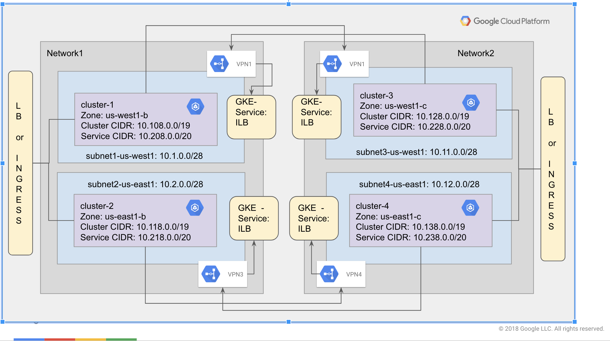
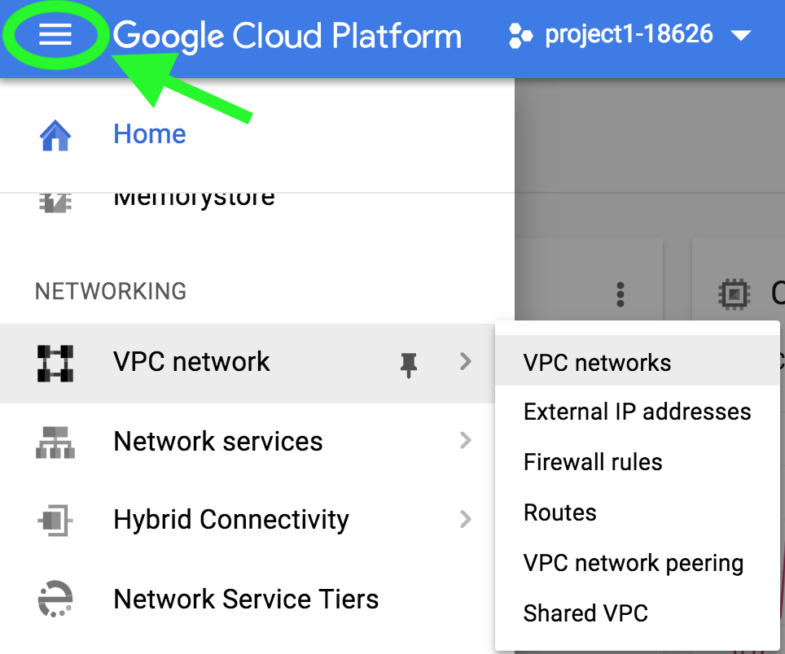
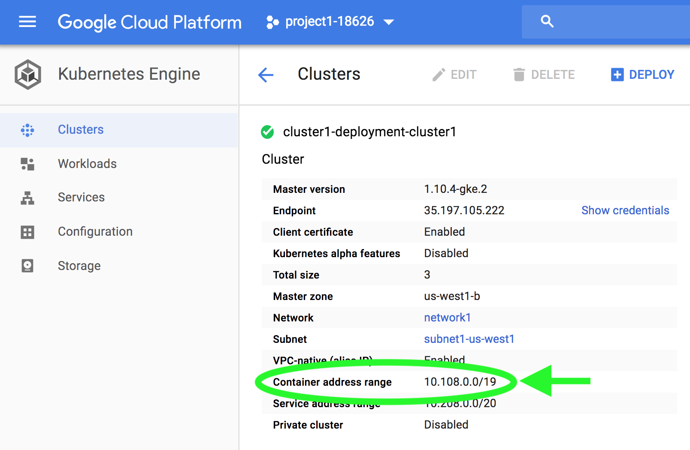
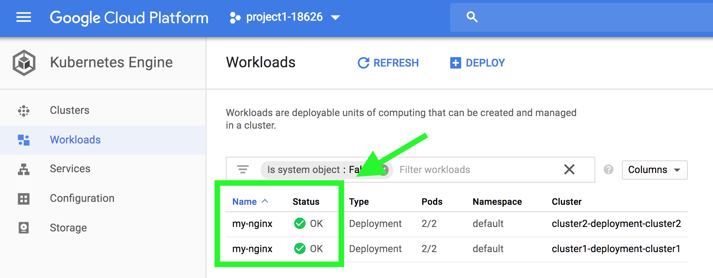
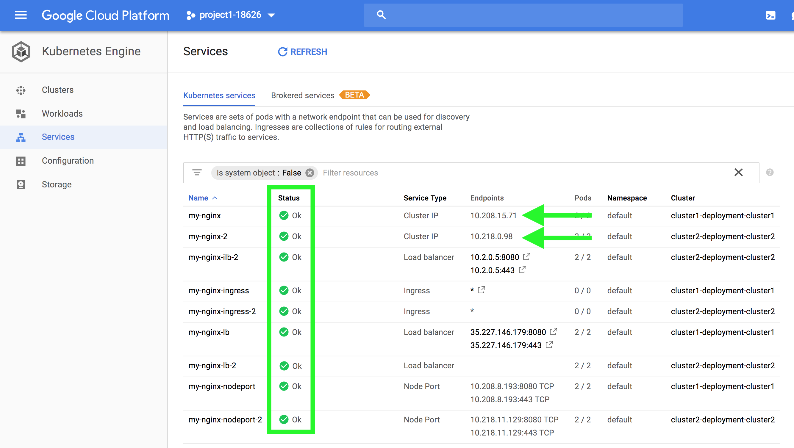
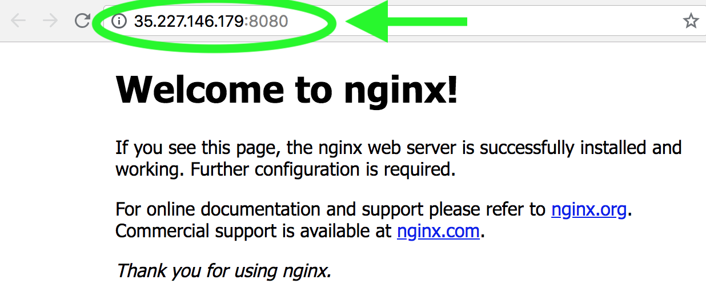

# Kubernetes Engine Networking Demo
## Kuberenetes Engine Communication Through VPN
## Table of Contents
<!--ts-->
* [Introduction](#introduction)
* [Architecture](#architecture)
   * [GCP Network network1](#gcp-network-network1)
      * [Kubernetes Engine Cluster 1](#gke-cluster-1)
      * [Kubernetes Engine Cluster 2](#gke-cluster-2)
      * [Other Resources](#other-resources)
   * [GCP Network network2](#gcp-network-network2)
      * [Kubernetes Engine Cluster 3](#gke-cluster-3)
      * [Kubernetes Engine Cluster 4](#gke-cluster-4)
      * [Other Resources](#other-resources-1)
   * [Notes](#notes)
* [Prerequisites](#prerequisites)
   * [Run Demo in a Google Cloud Shell](#run-demo-in-a-google-cloud-shell)
   * [Supported Operating Systems](#supported-operating-systems)
   * [Tools](#tools)
   * [Versions](#versions)
   * [Setup](#setup)
   * [Directory Structure](#directory-structure)
* [Deployment Steps](#deployment-steps)
* [Validation](#validation)
* [Verify the pod-to-service communication](#verify-the-pod-to-service-communication)
* [Tear Down](#tear-down)
* [Troubleshooting](#troubleshooting)
* [Deleting Resources Manually](#deleting-resources-manually)
* [Relevant Materials](#relevant-materials)
<!--te-->

## Introduction

Google Cloud networking with Kubernetes Engine clusters can be
complex.  This project strives to simplify the best practices for exposing cluster
services to other clusters and establishing network links between Kubernetes Engine clusters
running in separate projects or between a Kubernetes Engine cluster and a cluster running
in an on-premises datacenter.

The code contains a set of Deployment Manager templates that allows a user to
create networks, subnets, and Kubernetes Engine clusters. This project demonstrates the
following best practices.

1. Network design of launching Kubernetes Engine clusters in custom networks.
1. Assigning node CIDR, container CIDR and service CIDR for Kubernetes Engine clusters.
1. IP range management.
1. Exposing pods of Kubernetes Engine clusters over networks connected using VPN.

This example also includes Kubernetes manifests for:

1. Deploying Nginx pods in clusters.
1. Exposing Nginx pods of clusters with different types of services like cluster
IP, nodeport, internal load balancer, Network Load Balancer and Ingress.
1. Validating pod-to-service communication over networks connected using VPN.

## Architecture

The execution of this demo in the GCP environment creates two custom GCP networks. Each network will have two subnets one in the us-west1 region and the other in the us-east1 region. Each of the subnets hosts a Kubernetes Engine cluster which has nginx pods and services to expose those pods across other clusters. Both networks are connected using VPN. Kubernetes Engine internal load balancers are regional services. VPN gateway per region is needed to reach ILB services in that region. Hence four VPN gateways are created in both projects. Please refer to https://cloud.google.com/compute/docs/load-balancing/internal/#global_routing_issueVPN for more details.

In this project, we are using route-based VPN over policy-based VPN to establish pod-to-service communication. In the VPN tunnel configuration, node CIDR, pod CIDR and service CIDR's from peer remote network need to be added so that nodes, pods and services can reach exposed services from other clusters.



Below is the detailed overview of GCP resources which will be created.

### GCP Network 1
#### Kubernetes Engine Cluster 1
1. Subnet: subnet1-us-west1 (10.1.0.0/28)

|cluster-ipv4-cidr|service-ipv4-cidr|zone|Initial Node count|Node Image
|---|---|---|---|---|
|10.108.0.0/19|10.208.0.0/20|us-west1-b|3|COS

#### Kubernetes Engine Cluster 2
1. Subnet: subnet1-us-east1 (10.2.0.0/28)

|cluster-ipv4-cidr|service-ipv4-cidr|zone|Initial Node count|Node Image
|---|---|---|---|---|
|10.118.0.0/19|10.218.0.0/20|us-east1-b|3|COS

#### Other Resources
1. Cluster IP, Nodeport, ILB, LB and Ingress services to expose pods in each of
those clusters.
1. VPN gateways

|Gateway name|Google IP address|Network|Region|Tunnels
|---|---|---|---|---|
|vpn1-deployment-gateway|x.x.x.x|network1|us-west1|vpn1-deployment-tunnel|
|vpn2-deployment-gateway|x.x.x.x|network1|us-east1|vpn2-deployment-tunnel|

1. VPN Tunnels

|Tunnel name|Status|Google gateway|Google IP address|Google network|Region|Peer IP address|Routing type
|---|---|---|---|---|---|---|---|
|vpn1-deployment-tunnel|Established|vpn1-deployment-gateway|x.x.x.x|network1|us-west1|vpn3-static-ip|Route-based|
|vpn2-deployment-tunnel|Established|vpn2-deployment-gateway|x.x.x.x|network1|us-east1|vpn4-static-ip|Route-based|

### GCP Network 2
#### Kubernetes Engine Cluster 3

1. Subnet: subnet3-us-west1 (10.11.0.0/28)

|cluster-ipv4-cidr|service-ipv4-cidr|zone|Initial Node count|Node Image
|---|---|---|---|---|
|10.128.0.0/19|10.228.0.0/20|us-west1-c|3|COS|

#### Kubernetes Engine Cluster 4
1. Subnet: subnet4-us-east1 (10.12.0.0/28)

|cluster-ipv4-cidr|service-ipv4-cidr|zone|Initial Node count|Node Image
|---|---|---|---|---|
|10.138.0.0/19|10.238.0.0/20|us-east1-c|3|COS|

#### Other Resources
1. Cluster IP, Nodeport, ILB, LB and Ingress services to expose pods in each of
those clusters.
1. VPN gateways

|Gateway name|Google IP address|Network|Region|Tunnels|
|---|---|---|---|---|
|vpn3-deployment-gateway|x.x.x.x|network2|us-west1|vpn3-deployment-tunnel|
|vpn4-deployment-gateway|x.x.x.x|network2|us-east1|vpn4-deployment-tunnel|

1. VPN Tunnels

|Tunnel name|Status|Google gateway|Google IP address|Google network|Region|Peer IP address|Routing type|
|---|---|---|---|---|---|---|---|
|vpn3-deployment-tunnel|Established|vpn3-deployment-gateway|x.x.x.x|network2|us-west1|vpn1-static-ip|Route-based|
|vpn4-deployment-tunnel|Established|vpn4-deployment-gateway|x.x.x.x|network2|us-east1|vpn2-static-ip|Route-based|

### Notes
1. Region for subnets and Node CIDR can be customized in /network/network.yaml.
1. Cluster attributes like zone, image, node count, cluster CIDR and service CIDR can be customized in clusters/cluster.yaml.
1. To add additional custom attributes to network or clusters, yaml files (*.yaml) and deployment manager scripts (*.py) at "/network/" or "/clusters/" need to be updated accordingly.

## Prerequisites

A Google Cloud account and project is required for this.

Access to an existing Google Cloud project with the Kubernetes Engine service enabled
If you do not have a Google Cloud account please signup for a free trial
[here](https://cloud.google.com).

### Run Demo in a Google Cloud Shell

Click the button below to run the demo in a [Google Cloud Shell](https://cloud.google.com/shell/docs/).

[](https://console.cloud.google.com/cloudshell/open?cloudshell_git_repo=https://github.com/GoogleCloudPlatform/gke-networking-demos.git&cloudshell_git_branch=master&cloudshell_working_dir=gke-to-gke-vpn&cloudshell_tutorial=README.md)

All the tools for the demo are installed. When using Cloud Shell execute the following
command in order to setup gcloud cli.

```console
gcloud init
```

### Supported Operating Systems

This project will run on macOS, or in a [Google Cloud Shell](https://cloud.google.com/shell/docs/).

### Tools

When not using Cloud Shell, the following tools are required.

1. gcloud cli  ( >= Google Cloud SDK 200.0.0 )
2. bash
3. kubectl - ( >= v1.10.0-gke.0 )
4. jq

### Versions
1. Kubernetes Engine >= 1.10.0-gke.0

### Setup

1. Pull the code from git repo.
1. Optionally, customize the configuration in .yaml files under /network/ or /clusters/ or /manifests/, if needed.

### Directory Structure
1. The root folder is the "Kubernetes Engine-networking-demos" folder.
1. The "network" folder contains the manifest files and Deployment Manager templates to setup networks.
1. The "clusters" folder contains the manifest files and Deployment Manager templates to create Kubernetes Engine clusters.
1. The "manifests" folder contains the manifest files to create Kubernetes Engine services.

## Deployment Steps

The following steps will allow a user to run this demo.

1. Change directory to `gke-to-gke-vpn`
1. Run `./install.sh`

## Validation
1. Make sure that there are no errors in the install script execution.
1. Login to GCP console.
1. Use the navigation menu, accessible at the top-left of the console, to select services in the following steps.

1. Select "VPC networks" and confirm that CIDR ranges of subnet1-us-west1 is 10.1.0.0/28 and subnet2-us-east1 is 10.2.0.0/28
the specification.

1. Select "Compute Engine"-> VM instances and see that the cluster VM instances are are drawn from the subnet's CIDR ranges.

1. Select "Kubernetes Engine"->"cluster1" and see that "Container address range" matches the diagram (10.108.0.0/19). Repeat for the other three clusters:

    * Repeat for the other three clusters:
        * cluster2: 10.118.0.0/19
        * cluster3: 10.128.0.0/19
        * cluster4: 10.138.0.0/19
1. Select "Kubernetes Engine"-> "Workloads" and verify that the status is OK for nginx pods.

1. Select "Kubernetes Engine" -> "Services" and see that the cluster ip, nodeport, ILB and LB are created for cluster1 and that cluster IP address of all the services for a cluster are drawn the service ipv4 CIDR range

1. Try to access the IP of the  external load balancer to view the nginx pods. The external IP
will be displayed in the "my-nginx-lb" row:


1. Change directory to `gke-to-gke-vpn`
1. Run `./validate.sh`

## Verify the pod-to-service communication
1. Clusters in the same region communicate through the internal load balancer.
1. Clusters across the different regions communicate through the global load balancer, unless they are peered via VPN. When peered via VPN, clusters can still communicate via internal load balancers.
1. All the services created to expose pods in a cluster are accessible to pods within that cluster.
1. Refer to validate-pod-to-service-communication.sh script to view the commands to verify pod to service communication.
1. Change directory back to project root. Run `./validate-pod-to-service-communication.sh` located in the project root directory
1. The above script demonstrates how the pods in cluster1 can access the local Kubernetes Engine services and the other Kubernetes Engine Internal/External load balancer services from the same or different regions.

## Tear Down

1. Change directory to `gke-to-gke-vpn`
1. Run `./cleanup.sh`
1. Verify that the script executed with no errors.
1. Verify that all the resources created are deleted.


## Troubleshooting

1. Remember to enable API's as mentioned in deployment steps where the resources are to be created. Otherwise, API not enabled error is thrown.
1. Make sure to have the right permissions for the GCP account to create above GCP/Kubernetes Engine resources. Otherwise, permission denied error is thrown.
1. Make sure that the deployments created through install script are deleted before you try to re-install the resources. Otherwise, resources will not be installed properly.
1. If there are any errors in cleanup script execution, refer to steps for deleting resources manually.

## Deleting Resources Manually
1. Select the project in GCP cloud console.
1. Goto Kubernetes Engine -> services. Delete all the services created through install script.
1. Goto Network Services -> Load Balancing and delete the load balancers along with associated heathchecks.
1. Goto Compute Engine -> VM Instances and delete all the instances created through install script.
1. Goto Compute Engine -> Instance Groups and delete all the instance groups created through install script.
1. Goto VPC Networks -> Firewall Rules and delete the firewall rules created for network1.
1. Goto Deployment Manager -> Deployments and delete vpn, static-ip, cluster and network deployments in the same order.
1. Delete the dependent resources if network deployment doesn't get deleted.

## Relevant Materials

* [Cloud VPN Overview](https://cloud.google.com/vpn/docs/concepts/overview)
* [Internal Load Balancing](https://cloud.google.com/kubernetes-engine/docs/how-to/internal-load-balancing)
* [Exposing an Application to External Traffic](https://cloud.google.com/kubernetes-engine/docs/how-to/exposing-apps)
